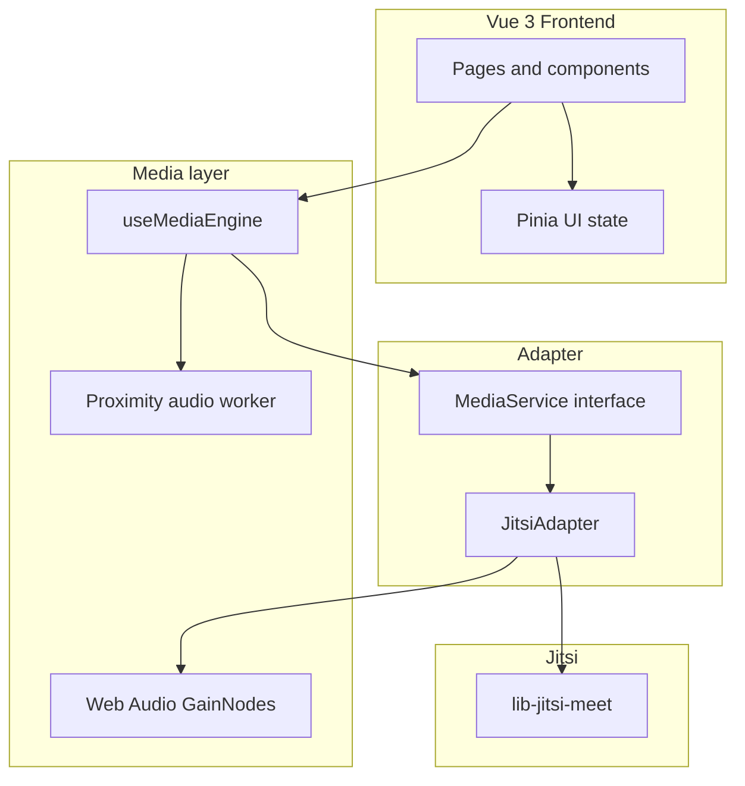

# Architecture

## Principles

1. **No iframe API** — `lib-jitsi-meet` exposes raw tracks for proximity volume and custom avatars.
2. **Adapter boundary** — Vue code never imports Jitsi directly; only `JitsiAdapter` does.
3. **Pinia for UI state** — connection and conference stores hold reactive UI data; lifecycle lives in `useMediaEngine`.
4. **Performance** — route-level code splitting, proximity math in a Web Worker, `GainNode` ramps for smooth audio.

## Key modules

| Path | Role |
|------|------|
| `src-vue/services/MediaService.ts` | Backend-agnostic interface |
| `src-vue/services/JitsiAdapter.ts` | Jitsi implementation + Web Audio routing |
| `src-vue/composables/useMediaEngine.ts` | Singleton composable, store sync |
| `src-vue/workers/proximityAudio.worker.ts` | Off-main-thread volume calculation |
