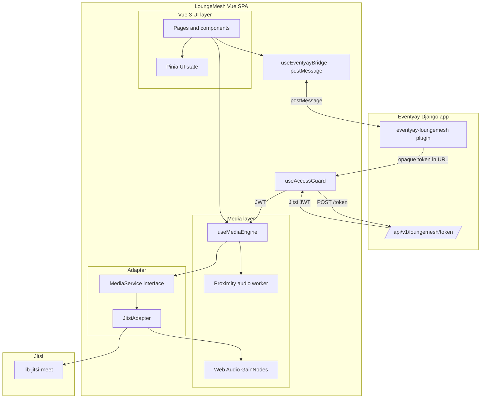

# Architecture



## Principles

1. **No iframe API** — `lib-jitsi-meet` exposes raw tracks for proximity volume and custom avatars.
2. **Adapter boundary** — Vue code never imports Jitsi directly; only `JitsiAdapter` does.
3. **Pinia for UI state** — connection and conference stores hold reactive UI data; lifecycle lives in `useMediaEngine`.
4. **Performance** — route-level code splitting, proximity math in a Web Worker, `GainNode` ramps for smooth audio, `shallowReactive` users map, composite `:key` on remote users to limit re-renders.
5. **Access control** — gated behind Eventyay JWT when `VITE_EVENTYAY_API_BASE` is set; open mode for self-hosted deployments.
6. **Iframe embedding** — Eventyay embeds LoungeMesh with a `postMessage` bridge; "Open in new tab" is the primary UX. Frame-ancestors CSP is configurable at Docker runtime.

## Key modules

| Path | Role |
|------|------|
| `src-vue/services/MediaService.ts` | Backend-agnostic media interface |
| `src-vue/services/JitsiAdapter.ts` | Jitsi implementation + Web Audio routing + JWT re-auth |
| `src-vue/composables/useMediaEngine.ts` | Singleton composable, store sync, token refresh wiring |
| `src-vue/composables/useAccessGuard.ts` | Eventyay token exchange, sessionStorage, JWT access control |
| `src-vue/composables/useEvenytayBridge.ts` | iframe ↔ Eventyay postMessage bridge |
| `src-vue/workers/proximityAudio.worker.ts` | Off-main-thread volume calculation |
| `src-vue/pages/JoinPage.vue` | Eventyay entry point (`/join/:id?token=`) |
| `src-vue/pages/AccessDeniedPage.vue` | Shown when token is missing or invalid |

## Eventyay integration flow

```
User clicks lounge icon in Eventyay
  ↓
eventyay-loungemesh plugin issues opaque token
  ↓
Redirect → /join/<jitsiRoom>?token=<opaque>
  ↓
useAccessGuard: POST token → Eventyay API
  ↓
Jitsi JWT returned, stored in sessionStorage
  ↓
Redirect → /session/<jitsiRoom>
  ↓
useMediaEngine.connect(jwt) → JitsiAdapter → lib-jitsi-meet
  ↓
On AUTHENTICATION_REQUIRED → token refresh → reconnect
```
